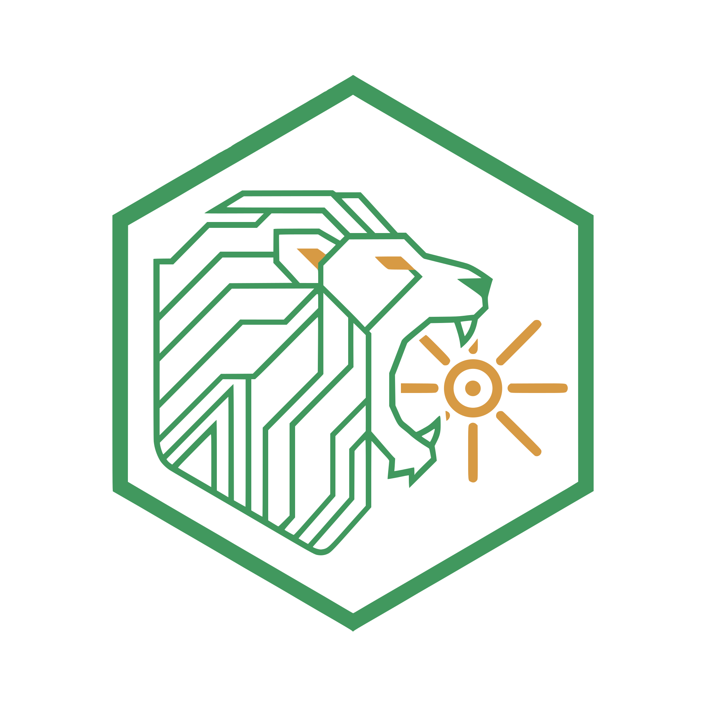

# VITRIOL - SSD-to-GPU Direct Streaming for Legacy Hardware


*"Visita Interiora Terrae Rectificando Invenies Occultum Lapidem"*

(Visit the Interior of the Earth, by Rectifying you will find the Hidden Stone)

## TL;DR

VITRIOL enables running large language models (like Qwen 3.5 9B) on **legacy hardware** (GTX 1070 Ti + i7-3770) by streaming model weights directly from SSD to GPU VRAM via PCIe DMA, bypassing the slow CPU bottleneck.

---

## Current Status

| Component | Status | Notes |
|-----------|--------|-------|
| llama.cpp + CUDA | ✅ Working | 10.6 tok/s with Qwen 3.5 9B |
| Kernel Module | ✅ Built | `vitriol-daemon/vitriol.ko` |
| NVIDIA GDS Analysis | ✅ Done | Source at `/mnt/data/ai/gds-nvidia-fs/` |
| KTransformers Patterns | ✅ Analyzed | Async double-buffer logic |
| VITRIOL Modes (flag-based) | ✅ Implemented | async/sync/stream modes |
| Benchmark Script | ✅ Ready | `benchmark_vitriol.sh` |

---

## Quick Start

### Option 1: Baseline (Recommended - Works Now)

```bash
# Start llama-server with CUDA
cd /mnt/data/ai/llama.cpp
./bin/llama-server \
    -m /mnt/data/ai/koboldcpp/Qwen_Qwen3.5-9B-Q4_K_M.gguf \
    -c 8192 \
    -ngl 25 \
    --port 5002

# Test inference
curl http://localhost:5002/v1/chat/completions \
  -H "Content-Type: application/json" \
  -d '{"messages":[{"role":"user","content":"Hello"}],"max_tokens":50}'
```

### Option 2: VITRIOL Modes (Flag-Dependent)

```bash
# Disabled (baseline)
VITRIOL_MODE=disabled ./llama-server -m model.gguf -ngl 25

# Sync (preload all to VRAM)
VITRIOL_MODE=sync ./llama-server -m model.gguf -ngl 25

# Async (KTransformers-style double-buffer)
VITRIOL_MODE=async VITRIOL_ASYNC_PREFETCH=1 ./llama-server -m model.gguf -ngl 25

# Stream (on-demand from SSD)
VITRIOL_MODE=stream ./llama-server -m model.gguf -ngl 15

# Run benchmark comparison
./benchmark_vitriol.sh
```

---

## Hardware Configuration

| Component | Details |
|-----------|---------|
| GPU | GTX 1070 Ti (device 1b82, 8GB VRAM) |
| CPU | i7-3770 (Ivy Bridge, no AVX2) |
| Storage | NVMe SSD on `/mnt/data/ai` |
| BAR1 Window | 256MB (VRAM aperture for DMA) |

---

## Architecture

### Current Working Stack

```
OpenCode → llama-server (port 5002) → ggml-cuda.cu → GPU VRAM
                                        ↓
                    Qwen 3.5 9B Q4_K_M (5.5GB) on SSD
```

**Performance:** ~10.6 tokens/second with 25 GPU layers

### Target Architecture (VITRIOL Moore Stream)

```
┌─────────────────────────────────────────────────────────────┐
│                    llama.cpp (modified)                      │
│  ┌─────────────────────────────────────────────────────────┐ │
│  │ VITRIOL Hooks (ggml-cuda.cu line 682)                   │ │
│  │  - disabled: Standard CUDA memcpy                       │ │
│  │  - async: Double-buffer prefetch (KTransformers style)  │ │
│  │  - stream: On-demand SSD→GPU DMA                        │ │
│  └─────────────────────────────────────────────────────────┘ │
└─────────────────────────┬───────────────────────────────────┘
                          │ IOCTL / DMA
                          ▼
┌─────────────────────────────────────────────────────────────┐
│              vitriol.ko (Kernel Module)                     │
│  - PCI probe (10de:1b82)                                   │
│  - BAR0 mapping (16MB control)                             │
│  - BAR1 mapping (256MB data window)                        │
│  - DMA buffer allocation                                   │
└─────────────────────────┬───────────────────────────────────┘
                          │ PCIe
                          ▼
┌─────────────────────────────────────────────────────────────┐
│                    NVMe SSD ←→ GPU VRAM                     │
│              (Direct P2P DMA, no CPU involvement)          │
└─────────────────────────────────────────────────────────────┘
```

---

## Key Files

| Path | Description |
|------|-------------|
| `/mnt/data/ai/llama.cpp/bin/llama-server` | CUDA inference server (9.5MB) |
| `/mnt/data/ai/llama.cpp/bin/libggml-cuda.so` | CUDA backend (74MB) |
| `/mnt/data/ai/koboldcpp/Qwen_Qwen3.5-9B-Q4_K_M.gguf` | Model (5.5GB) |
| `vitriol-daemon/vitriol.ko` | Kernel module (410KB) |
| `vitriol-daemon/vitriol-util` | Userspace utility |
| `include/vitriol-config.h` | Mode configuration |
| `ggml/src/ggml-cuda/vitriol-cuda-integration.cpp` | CUDA hooks |

---

## Key Insights from NVIDIA GDS & KTransformers

### NVIDIA GDS (GPUDirect Storage)
- Source: `/mnt/data/ai/gds-nvidia-fs/src/nvfs-core.c`
- Uses `kiocb` completion callbacks for NVMe
- Shared "metapage" for fast completion signaling
- Memory barriers (`wmb()`) before DMA

### KTransformers (Async Scheduling)
- YAML-based layer placement (for Alembic Substrate)
- Double-buffer prefetch: compute layer N while streaming N+1
- Arithmetic intensity: Attention→GPU, MoE→CPU/SSD

---

## KTransformers Comparison

| Aspect | KTransformers | VITRIOL |
|--------|---------------|---------|
| Hot Path | CPU math (AMX/AVX512) | GPU (CUDA) |
| Cold Path | GPU (minimal) | NVMe DMA |
| CPU Role | Compute MoE experts | Orchestration only |
| Target | Modern Xeon (400GB/s) | Legacy Ivy Bridge |
| **VITRIOL Advantage** | - | Bypasses CPU entirely |

---

## Documentation Files

| File | Purpose |
|------|---------|
| `PROJECT_STATUS.md` | Full project status |
| `SESSION_SUMMARY.md` | Session-by-session summary |
| `NVIDIA_GDS_INFO.md` | GDS source analysis |
| `NVIDIA_OPENSOURCE_TREASURES.md` | NVIDIA repos (gds-nvidia-fs, open-gpu-kernel-modules, hw-nvdla) |
| `KTRANSFORMERS_ANALYSIS.md` | Async scheduling analysis |
| `VITRIOL_MOORE_STREAM_IMPLEMENTATION.md` | DMA implementation plan |

---

## Next Steps

1. **Load kernel module on target system:**
   ```bash
   sudo insmod vitriol-daemon/vitriol.ko
   dmesg | tail
   ```

2. **Test VITRIOL modes:**
   ```bash
   ./benchmark_vitriol.sh
   ```

3. **Implement true NVMe→GPU DMA:**
   - Integrate kernel module with llama.cpp
   - Implement sliding window for 256MB BAR1 limit
   - Add metapage completion signaling

---

## References

- NVIDIA GDS: https://github.com/NVIDIA/gds-nvidia-fs
- KTransformers: https://github.com/kvcache-ai/KTransformers
- llama.cpp: https://github.com/ggml-org/llama.cpp

---

*VITRIOL: Turning the Fever Dream into Engineering Reality*